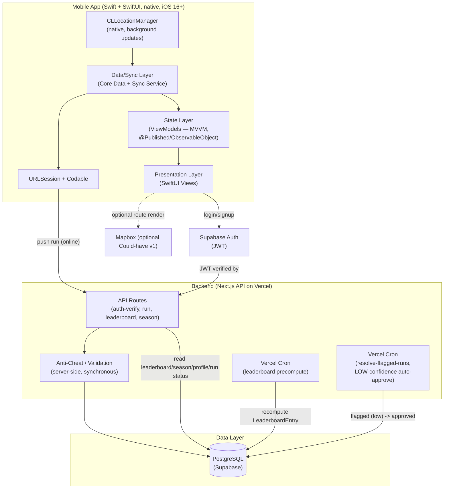

# Laju App — Architecture (v1)

Depends on: [tech-spec.md](./tech-spec.md)

## 1. High-Level Architecture

**Backend & data layer (`Backend`/`Data` subgraphs above) are unchanged by
this pivot** — Next.js API routes, anti-cheat validation, both Vercel Cron
jobs, Supabase Auth, and the Postgres schema are entirely client-language
agnostic. This pivot only redesigns the `Mobile` subgraph (React Native →
native Swift/SwiftUI).

## 2. End-to-End Data Flow: GPS → Points → Leaderboard

1. **Track**: `CLLocationManager` (native, `allowsBackgroundLocationUpdates`)
   streams GPS points to the Data/Sync layer while a run is active
   (foreground or background).
2. **Local compute**: On run stop, the Sync layer computes an **optimistic**
   point estimate locally (same formula as server, see tech-spec §2.2/§2.2b),
   and writes the run to a local Core Data `Run` entity with
   `sync_status = pending_sync` (client-only field, distinct from server
   `RUN.status` — tech-spec §3).
3. **Display**: State layer (ViewModel) surfaces the local estimate
   immediately in the UI (product-spec AC 4.3.1: <2s).
4. **Sync**: When connectivity is available, the sync service POSTs the raw
   run (GPS trail + metadata) via `URLSession` to `POST /api/runs`.
5. **Server validation**: Backend re-runs point calculation + anti-cheat
   checks (tech-spec §2.4) against the raw GPS trail — client-computed
   points are never trusted directly.
6. **Ledger write**: A `PointTransaction` row is appended (immutable) with
   the server-validated point amount. `User.total_points` /
   `User.current_level` are updated from the ledger.
7. **Leaderboard precompute**: A scheduled job (Vercel Cron, interval ≤15
   min) recomputes `LeaderboardEntry` rows per scope (`global`,
   `kecamatan`, `kabupaten_kota`, `provinsi`) per active season, from the
   `PointTransaction` ledger — **not** computed live on read. Only runs
   with `RUN.status` `validated` or `approved` contribute (tech-spec.md
   §2.4.1) — `flagged` and `rejected` runs are excluded until resolved.
   The same job also writes/updates one `LEADERBOARD_SCOPE` row for
   `scope_type=global` (`scope_id='GLOBAL'` sentinel — not null, since
   the composite PK cannot hold NULL — `insufficient_data=false` always),
   from Fase 2 onward — `global` is an explicit scope value in that
   table, never represented by an absent row (database-api-spec.md §1).
8. **Flagged-run resolution**: A separate scheduled job
   (`resolve-flagged-runs`, Vercel Cron) auto-transitions LOW-confidence
   `flagged` runs to `approved` after `REVIEW_WINDOW_LOW` (default 48h),
   per tech-spec.md §2.4.1. HIGH-confidence flags are never touched by
   this job — they wait for manual override. This is the component that
   makes the flagged→approved transition actually happen; it is separate
   from the leaderboard precompute job in step 7. Every transition
   touches `RUN.updated_at` (database-api-spec.md §1), which is what
   step 10 below filters on.
9. **Read**: Leaderboard screens read directly from the precomputed
   `LeaderboardEntry` table — fast, no aggregation at request time.
10. **Status reconciliation** (endpoint: T2.14c; client loop: T2.14d): On
   app open and each sync cycle — but only when the client holds at
   least one locally-stored run whose locally-cached copy of the server
   `RUN.status` is `flagged`, and only if ≥15 minutes have passed since
   the last attempt (persisted, survives restarts) — the client calls
   `GET /api/runs?since=<last_reconciled_at>` (database-api-spec.md
   §2.2b; `since` omitted entirely on the very first call, server
   defaults to a 90-day lookback, results returned oldest-changed-first).
   `last_reconciled_at` is the `server_time` value from the previous
   response — except when that response was capped (`has_more: true`),
   in which case the cursor is the **last returned row's `updated_at`**
   instead (using `server_time` there would skip the undrained rows).
   Either way it's a server-issued value, never a device-local timestamp
   — avoids clock-skew bugs. When capped, the client drains it with
   immediate follow-up calls before waiting for the next cycle. For each
   returned
   run (matched to a local row by `server_run_id`), it updates the
   locally-cached `server_status`, `flag_confidence`,
   `final_points_awarded`, `anomaly_flags`, and `resolved_at` (Core Data
   save — re-renders that run's own row, e.g. in run history), **and**
   separately calls `ProgressViewModel.refresh()` (T2.16) to re-fetch
   server-derived profile/progress data — the Core Data save alone does
   not trigger that re-fetch — so a resulting points/level change
   re-renders (including a level *decrease*, which
   is expected behavior, not an error). This is the mechanism that
   surfaces a background resolution to the user — step 4's response only
   ever carries the *initial* status (tech-spec.md §3 step 7).

## 3. Mobile App Layering

| Layer | Responsibility | Notes |
|---|---|---|
| Presentation | SwiftUI Views, navigation | No direct Core Data/network calls — reads from State layer (ViewModel) only. |
| State (ViewModel) | `ObservableObject`/`@Published` — ephemeral/local UI state (active run, timers) + server-derived data (profile, leaderboard, season) surfaced from Data/Sync | ViewModel owns presenting caching/retry/staleness state to the View; underlying persistence/caching itself lives in Data/Sync. |
| Data/Sync | Core Data (`Run`, `SyncMeta` entities — sync queue, cached leaderboard snapshot for offline viewing) + sync service | Only layer allowed to talk to `CLLocationManager` and the network (`URLSession`). Presentation/State never call the API or location manager directly. |

This separation exists specifically so offline-first behavior (tech-spec §3)
is isolated to one layer — the UI does not need to know whether data came
from local cache or a fresh server response.

## 4. Leaderboard Scalability Strategy

Leaderboard reads are the heaviest, most frequent query pattern in the
product (every user checks their rank often; local leaderboard multiplies
the number of distinct scopes — one per kecamatan/kabupaten_kota/provinsi,
per season).

**Strategy: precompute, don't aggregate on read.**

- `LeaderboardEntry` is a materialized table: `(season_id, scope_type,
  scope_id, user_id, points, rank, computed_at)`.
- Indexed on `(season_id, scope_type, scope_id, points DESC)` — leaderboard
  reads become a simple indexed range scan, not a `GROUP BY` over the full
  `PointTransaction` ledger.
- Recompute job runs on an interval (v1: ≤15 min, matches product-spec AC
  4.5.2), not on every point transaction — trades freshness for cost,
  deliberately (tech-spec §4).
- Small-region handling: if a scope (e.g. a specific kecamatan) has fewer
  than N users (configurable, e.g. 5), the precompute job marks that scope
  `insufficient_data` in the dedicated `LEADERBOARD_SCOPE` table
  (database-api-spec.md §1) instead of emitting a near-empty leaderboard —
  client renders product-spec AC 4.6.2 ("belum cukup data") from this
  persisted flag rather than inferring it from row count. `LEADERBOARD_SCOPE`
  is migrated in Fase 2 (not Fase 3) since the `global` scope needs a row
  from the moment the global leaderboard ships; Fase 3 only adds rows for
  the local scope types on top of the table that already exists.

**v1 scale target**: this is sufficient for the initial user base a single
Postgres instance handles comfortably (tens of thousands of users,
precompute job completing well within the 15-minute window).

**Open Question (v2+, not built now)**: if global leaderboard needs
near-real-time updates (interval < 1 min) at much larger scale, consider a
Redis sorted set (`ZADD`/`ZREVRANGE`) as a read-through cache in front of
Postgres for the global scope specifically — Postgres remains source of
truth, Redis becomes a fast projection. Not adopted in v1 to avoid adding a
new piece of infrastructure before it's needed.
