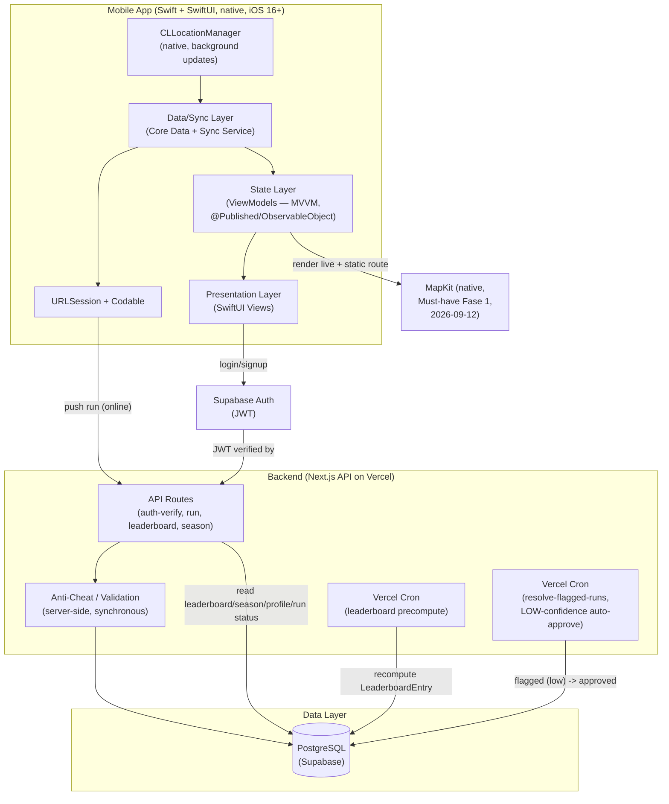

# Laju App — Architecture (v1)

Depends on: [tech-spec.md](./tech-spec.md)
Decision record: [adr/](./adr/README.md) · Security: [security-review.md](../04-quality-security/security-review.md) · Code audit: [code-quality-audit.md](../04-quality-security/code-quality-audit.md)

This document describes the system as designed and as built. It is organized as: what the system *is* (§1-§4), *why it is that way* (§5), *how it fails and what it exposes* (§6), and *how accurate this description currently is* (§7).

## 1. High-Level Architecture

`Maps` is fed from the **State layer** (`RunViewModel`'s published
location/route state), not sourced directly by Presentation — correction
2026-09-13, Round 7 finding N7-14: an edge straight from `UI` misread as
Presentation independently reaching for map data, contradicting §3's own
rule that Presentation has no direct Core Data/network calls and only
reads from State.

**Backend & data layer (`Backend`/`Data` subgraphs above) are unchanged by
this pivot** — Next.js API routes, anti-cheat validation, both Vercel Cron
jobs, Supabase Auth, and the Postgres schema are entirely client-language
agnostic. This pivot only redesigns the `Mobile` subgraph (React Native →
native Swift/SwiftUI).

## 2. End-to-End Data Flow: GPS → Points → Leaderboard

1. **Track**: `CLLocationManager` (native, `allowsBackgroundLocationUpdates`)
   streams GPS points to the Data/Sync layer while a run is active
   (foreground or background).
2. **Local compute**: On run stop, the Sync layer computes an **optimistic**
   point estimate locally (same formula as server, see tech-spec §2.2/§2.2b),
   and writes the run to a local Core Data `Run` entity with
   `sync_status = pending_sync` (client-only field, distinct from server
   `RUN.status` — tech-spec §3).
   *(§7 Drift 2: this sentence is now stale in two respects — the code computes
   the estimate in the State layer, not Data/Sync, and continuously during the
   run rather than only at stop. Left unchanged pending the decision in §7.)*
3. **Display**: State layer (ViewModel) surfaces the local estimate
   immediately in the UI (product-spec AC 4.3.1: <2s).
4. **Sync**: When connectivity is available, the sync service POSTs the raw
   run (GPS trail + metadata) via `URLSession` to `POST /api/runs`.
5. **Server validation**: Backend re-runs point calculation + anti-cheat
   checks (tech-spec §2.4) against the raw GPS trail — client-computed
   points are never trusted directly.
6. **Ledger write**: A `PointTransaction` row is appended (immutable) with
   the server-validated point amount. `User.total_points` /
   `User.current_level` are updated from the ledger.
7. **Leaderboard precompute**: A scheduled job (v1: pg_cron, interval
   15 min — T2.18) recomputes `LeaderboardEntry` rows for the **`global`**
   scope per active season, from the `PointTransaction` ledger — **not**
   computed live on read. *(v1 is Global-only. Per-region scopes —
   `kecamatan`, `kabupaten_kota`, `provinsi` — are a **deferred future
   extension**, Local Leaderboard, v1.1 / Fase 4, decided 2026-09-21; the
   data model below already supports them and is left in place.)* Only runs
   with `RUN.status` `validated` or `approved` contribute (tech-spec.md
   §2.4.1) — `flagged` and `rejected` runs are excluded until resolved.
   The same job also writes/updates one `LEADERBOARD_SCOPE` row for
   `scope_type=global` (`scope_id='GLOBAL'` sentinel — not null, since
   the composite PK cannot hold NULL — `insufficient_data=false` always),
   from Fase 2 onward — `global` is an explicit scope value in that
   table, never represented by an absent row (database-api-spec.md §1).
8. **Flagged-run resolution**: A separate scheduled job
   (`resolve-flagged-runs`, Vercel Cron) auto-transitions LOW-confidence
   `flagged` runs to `approved` after `REVIEW_WINDOW_LOW` (default 48h),
   per tech-spec.md §2.4.1. HIGH-confidence flags are never touched by
   this job — they wait for manual override. This is the component that
   makes the flagged→approved transition actually happen; it is separate
   from the leaderboard precompute job in step 7. Every transition
   touches `RUN.updated_at` (database-api-spec.md §1), which is what
   step 10 below filters on.
9. **Read**: Leaderboard screens read directly from the precomputed
   `LeaderboardEntry` table — fast, no aggregation at request time.
10. **Status reconciliation** (endpoint: T2.14c; client loop: T2.14d): On
   app open and each sync cycle — but only when the client holds at
   least one locally-stored run whose locally-cached copy of the server
   `RUN.status` is `flagged`, and only if ≥15 minutes have passed since
   the last attempt (persisted, survives restarts) — the client calls
   `GET /api/runs?since=<last_reconciled_at>` (database-api-spec.md
   §2.2b; `since` omitted entirely on the very first call, server
   defaults to a 90-day lookback, results returned oldest-changed-first).
   `last_reconciled_at` is the `server_time` value from the previous
   response — except when that response was capped (`has_more: true`),
   in which case the cursor is the **last returned row's `updated_at`**
   instead (using `server_time` there would skip the undrained rows).
   Either way it's a server-issued value, never a device-local timestamp
   — avoids clock-skew bugs. When capped, the client drains it with
   immediate follow-up calls before waiting for the next cycle. For each
   returned
   run (matched to a local row by `server_run_id`), it updates the
   locally-cached `server_status`, `flag_confidence`,
   `final_points_awarded`, `anomaly_flags`, and `resolved_at` (Core Data
   save — re-renders that run's own row, e.g. in run history), **and**
   separately calls `ProgressViewModel.refresh()` (T2.16) to re-fetch
   server-derived profile/progress data — the Core Data save alone does
   not trigger that re-fetch — so a resulting points/level change
   re-renders (including a level *decrease*, which
   is expected behavior, not an error). This is the mechanism that
   surfaces a background resolution to the user — step 4's response only
   ever carries the *initial* status (tech-spec.md §3 step 7).

## 3. Mobile App Layering

| Layer | Responsibility | Notes |
|---|---|---|
| Presentation | SwiftUI Views, navigation | No direct Core Data/network calls — reads from State layer (ViewModel) only. |
| State (ViewModel) | `ObservableObject`/`@Published` — ephemeral/local UI state (active run, timers) + server-derived data (profile, leaderboard, season) surfaced from Data/Sync | ViewModel owns presenting caching/retry/staleness state to the View; underlying persistence/caching itself lives in Data/Sync. |
| Data/Sync | Core Data (`Run`, `SyncMeta` entities — sync queue, cached leaderboard snapshot for offline viewing) + sync service | Only layer allowed to talk to `CLLocationManager` and the network (`URLSession`). Presentation/State never call the API or location manager directly. |

This separation exists specifically so offline-first behavior (tech-spec §3)
is isolated to one layer — the UI does not need to know whether data came
from local cache or a fresh server response.

## 4. Leaderboard Scalability Strategy

Leaderboard reads are the heaviest, most frequent query pattern in the
product (every user checks their rank often). v1 computes **one** scope
(`global`) per season. The deferred Local Leaderboard (v1.1 / Fase 4,
decided 2026-09-21) would multiply the number of distinct scopes — one per
kecamatan/kabupaten_kota/provinsi, per season — which is exactly why the
precompute design below is kept as-is for it.

**Strategy: precompute, don't aggregate on read.**

- `LeaderboardEntry` is a materialized table: `(season_id, scope_type,
  scope_id, user_id, points, rank, computed_at)`.
- Indexed on `(season_id, scope_type, scope_id, points DESC)` — leaderboard
  reads become a simple indexed range scan, not a `GROUP BY` over the full
  `PointTransaction` ledger.
- Recompute job runs on an interval (v1: ≤15 min, matches product-spec AC
  4.5.2), not on every point transaction — trades freshness for cost,
  deliberately (tech-spec §4).
- *(Deferred with the Local Leaderboard — designed, prepared in the schema,
  not active in v1, where `insufficient_data` is always `false` for
  `global`.)* Small-region handling: if a scope (e.g. a specific kecamatan) has fewer
  than N users (configurable, e.g. 5), the precompute job marks that scope
  `insufficient_data` in the dedicated `LEADERBOARD_SCOPE` table
  (database-api-spec.md §1) instead of emitting a near-empty leaderboard —
  client renders product-spec AC 4.6.2 ("belum cukup data") from this
  persisted flag rather than inferring it from row count. `LEADERBOARD_SCOPE`
  is migrated in Fase 2 since the `global` scope needs a row from the
  moment the global leaderboard ships; rows for the local scope types go on
  top of the table that already exists, when the Local Leaderboard is built
  (deferred to v1.1 / Fase 4 — tasks T3.2–T3.5 in tasks/phase-4-backlog.md).

**v1 scale target**: this is sufficient for the initial user base a single
Postgres instance handles comfortably (tens of thousands of users,
precompute job completing well within the 15-minute window).

**Open Question (v2+, not built now)**: if global leaderboard needs
near-real-time updates (interval < 1 min) at much larger scale, consider a
Redis sorted set (`ZADD`/`ZREVRANGE`) as a read-through cache in front of
Postgres for the global scope specifically — Postgres remains source of
truth, Redis becomes a fast projection. Not adopted in v1 to avoid adding a
new piece of infrastructure before it's needed.

## 5. Architecture Decisions (why the system looks like this)

Sections 1-4 describe *what* the system is. The reasoning behind each
structural choice — including the alternatives that were rejected and what
each choice costs — is recorded as Architecture Decision Records in
**[adr/](./adr/README.md)**. Thirteen decisions are documented, in Nygard
format (Context / Decision / Alternatives Considered / Consequences).

These are formalizations of decisions already made and already validated
through seven-plus rounds of pre-execution audit and real on-device
evidence. They are not proposals, and reading them is not a prerequisite
for reading this document — but every non-obvious shape in the diagrams
above has its rationale in exactly one of them.

Mapped to the sections they explain:

| This document | Decisions that produced it |
|---|---|
| §1 `Mobile` subgraph | [ADR-0001](./adr/0001-native-swift-swiftui-over-react-native.md) native Swift/SwiftUI over React Native · [ADR-0002](./adr/0002-core-data-over-swiftdata.md) Core Data over SwiftData · [ADR-0003](./adr/0003-clocationmanager-direct-over-third-party.md) `CLLocationManager` direct, no third-party GPS library |
| §1 `Maps` node | [ADR-0011](./adr/0011-mapkit-over-mapbox.md) MapKit over Mapbox — including why the user position must be a custom annotation and never `showsUserLocation` |
| §1 `Backend`/`Data` subgraphs | [ADR-0005](./adr/0005-nextjs-supabase-vercel-backend-stack.md) Next.js + Supabase + Vercel · [ADR-0006](./adr/0006-postgres-over-firestore.md) PostgreSQL over Firestore |
| §2 steps 1-3 (track, local compute, display) | [ADR-0004](./adr/0004-stationary-anchor-anti-drift-strategy.md) stationary-anchor drift filter · [ADR-0012](./adr/0012-periodic-timer-auto-pause-evaluation.md) periodic-timer auto-pause evaluation · [ADR-0007](./adr/0007-fixture-parity-file-for-cross-language-formula-consistency.md) fixture-parity for the client's optimistic estimate |
| §2 step 5 (server validation) | [ADR-0008](./adr/0008-server-anti-cheat-separate-from-client-sanity-filter.md) server-side anti-cheat as a separate architecture from the client sanity filter |
| §2 steps 2 **and** 5 (the point formula itself, both sides) | [ADR-0009](./adr/0009-minimum-distance-gate-anti-farming.md) minimum-distance gate — a formula rule (tech-spec.md §2.2), not an anti-cheat check, so it binds the client's optimistic estimate and the server's authoritative calculation equally |
| §2 steps 6-7, §4 entire | [ADR-0013](./adr/0013-append-only-ledger-and-precomputed-leaderboard.md) append-only ledger with a separately precomputed leaderboard table |
| §2 step 10 (reconciliation) | [ADR-0010](./adr/0010-cursor-based-status-reconciliation.md) cursor-based reconciliation, ASC + `has_more`, server-issued cursor |

Two decisions carry an explicit qualifier rather than being locked: ADR-0005
and ADR-0006 are recorded as strong recommendations, with the database choice
reserved for final PM confirmation (tech-spec.md §1). The decisions that
tech-spec.md §1 marks **locked** are its four stack-table rows — mobile client
(ADR-0001), GPS tracking (ADR-0003), local storage (ADR-0002), and Maps SDK
(ADR-0011). The other ADRs record decisions taken outside that table, in
tech-spec.md's design sections or in response to on-device evidence; they are
no less binding, they are simply not stack choices.

**Two limits of this table, stated so it is not over-read.** First, it maps
ADRs to the sections they explain — not every ADR's subject matter appears in
§1-§4 at all. ADR-0004 (stationary-anchor drift filtering) and ADR-0012
(periodic-timer auto-pause) govern behavior inside §2 step 1 that this document
summarizes as "streams GPS points"; the detail lives in tech-spec.md §2.1b, and
the ADRs are listed against step 1 because that is where a reader would look
for it, not because step 1 describes it. Second, §3's layering table has no row
here on purpose — ADR-0002's consequences bear on it directly, and §7 Drift 1
records an unresolved conflict between the two that a mapping row would paper
over.

## 6. Security Considerations

Full findings, with severity and remediation ownership, are in
**[security-review.md](../04-quality-security/security-review.md)** (specification and data-handling
level) and **[code-quality-audit.md](../04-quality-security/code-quality-audit.md)** (implementation
level). This section states only what a reader of the architecture needs to
know about where the system's security properties live, and where they do not
yet exist.

### 6.1 Where trust boundaries sit

Three boundaries in §1's diagram are load-bearing, and the design depends on
each holding:

- **Client → API.** The client is never trusted for *content*. §2 step 5
  re-runs point calculation and anti-cheat against the raw GPS trail
  server-side; the client's optimistic estimate (§2 step 2) is display-only and
  is never written to the ledger. This is the foundational assumption of
  [ADR-0008](./adr/0008-server-anti-cheat-separate-from-client-sanity-filter.md),
  and the reason the client-side GPS sanity filter and the server-side
  anti-cheat system are deliberately not unified. **The boundary does not yet
  hold for *volume*, however**: no endpoint has a server-side request ceiling,
  and the one throttle the design does specify — §2 step 10's ≥15-minute
  reconciliation cadence — is explicitly a client-side rule
  (database-api-spec.md §2.2b), i.e. enforced on the untrusted side of this
  exact boundary. See SEC-9 in §6.3.
- **API → database.** Every query is scoped to the caller's `user_id` taken
  from the verified JWT, never from a client-supplied identifier
  (database-api-spec.md §3). This eliminates the IDOR class structurally
  rather than per-endpoint, and it is the single most important line in the
  API specification to preserve across any future refactor.
- **Backend → Supabase Admin API.** The service-role key is backend-only and
  must never reach the mobile client (database-api-spec.md §2.1b) — which is
  why account deletion is a dedicated backend endpoint rather than a client
  SDK call.

### 6.2 The sensitive asset

`RUN.gps_route` — and its local counterpart `Run.gpsRoute` — is the asset that
governs this system's risk profile. It is a precise, timestamped trace of where
a real person physically was, and for most users its endpoints are their home
address. Every other data category the app holds is ordinary by comparison.

Two consequences shape the architecture:

- It is uploaded at full fidelity (§2 step 4) because the anti-cheat checks in
  §2 step 5 compute instantaneous speed and elevation deltas, which a summary
  cannot support. The collection is purpose-bound, but the corpus is real.
- It is retained indefinitely, on the server and on the device, **because no
  retention decision has ever been made** — not because indefinite retention
  was chosen. See §6.3.

### 6.3 Known gaps, as of 2026-09-17

Two findings are rated Blocker, and both share a shape worth stating plainly
in this document: neither is an error in anything that was decided. Both are
places where a decision was never made, and where the default that results
from not deciding is the unsafe one.

| Finding | Gap | Blocks |
|---|---|---|
| [SEC-1](../04-quality-security/security-review.md) | No retention policy for GPS route data, server-side or local | The Privacy Policy (pre-launch-checklist.md §1), which blocks App Store submission |
| [SEC-9](../04-quality-security/security-review.md) | No rate limiting specified on any endpoint; the only throttle in the system is client-side and therefore bypassable (database-api-spec.md §2.2b states this explicitly) | Fase 2 backend launch — belongs in the same gate that already blocks the public leaderboard on verified anti-cheat |

Seven Warning-level findings cover Core Data at-rest protection, session token
storage, the un-designed anonymization strategy behind lean-canvas.md's
"Unfair Advantage", `RUN.anomaly_flags` surviving account deletion, the absent
`gps_route` size cap, Indonesian UU PDP obligations (including cross-border
transfer, a direct consequence of ADR-0005's hosting choice), and the absence
of any data-export path. See security-review.md §6 for the full register.

One Blocker exists at the implementation level, and it matters architecturally
because of what it undermines rather than what it is:
[CQ-2](../04-quality-security/code-quality-audit.md) — **§2 step 2's local durability guarantee is
not currently sound.** The incremental-flush design that makes a run survive a
force-kill can, on either of two error paths, silently discard the route it was
protecting, in a way indistinguishable from success. The offline-first property
§3 isolates into the Data/Sync layer therefore has a gap at its foundation. No
code was changed; see code-quality-audit.md CQ-2 for the mechanism.

### 6.4 What is verified sound

Recorded so these are not re-audited without cause:

- **Account deletion** is closed end-to-end — Apple Guideline 5.1.1(v) →
  product-spec.md §4.17 → database-api-spec.md §2.1b's endpoint contract →
  T2.22's DoD. Both historical findings (a JWT remaining valid after deletion,
  and local device data not being wiped) are final, enforceable requirements
  with named owners, not recorded observations. security-review.md §2 states
  the verification in full.
- **Input validation** is specified per endpoint with stated rationale
  (database-api-spec.md §3).
- **Data-race safety**: the iOS target builds clean under Swift 6 language
  mode with `SWIFT_STRICT_CONCURRENCY: complete` and warnings-as-errors, so no
  compiler-detectable data race exists in the Fase 1 code
  ([code-quality-audit.md](../04-quality-security/code-quality-audit.md) §0).

## 7. Accuracy verification (2026-09-17)

§1-§4 were re-checked against the Fase 1 code on disk after the many changes
since they were written. Their content was deliberately left unmodified; this
section records the result of that check, including the two places where the
document and the code have drifted apart. **Neither drift is resolved here** —
both are reported for a decision, because resolving either means changing a
design rule rather than correcting a description.

**Verified accurate:**

- §1's edge direction `GeoLib → Sync → State → UI` matches the code:
  `LocationTrackingService` publishes through a Combine subject, `RunViewModel`
  consumes it, views read `RunViewModel`.
- §1's `State → Maps` edge (the Round 7 N7-14 correction) is correct —
  `RunMapView` renders from `RunViewModel`'s published `routeCoordinates` /
  `currentCoordinate`, and opens no location subscription of its own.
- ADR-0011's `showsUserLocation` prohibition holds in code:
  `RunMapView.swift:28` sets it explicitly to `false`, with the reason in a
  comment. `CLLocationManager` appears outside `LocationTrackingService` in
  three places — `RunViewModel.swift:19`, `RunViewModel.swift:170`, and
  `RunMapView.swift:24` — all of them explanatory comments, none a call site.
- §3's rule that only the Data/Sync layer talks to `CLLocationManager` holds.
- §4's precompute strategy matches database-api-spec.md's rebuild-not-upsert
  model, including the soft-delete exclusion.

**Drift 1 — §3 forbids Presentation-layer Core Data access; the code does it.**
§3's layering table states Presentation performs "No direct Core Data/network
calls — reads from State layer (ViewModel) only." In the current code,
`ProfileView.swift:9` and `RunHistoryView.swift:15` both use `@FetchRequest`,
reading Core Data directly.

This is not a careless violation, which is why it is reported rather than
corrected: `@FetchRequest` is the idiomatic SwiftUI/Core Data pattern, and
[ADR-0002](./adr/0002-core-data-over-swiftdata.md) explicitly lists
`@FetchRequest` integration among the *benefits* of choosing Core Data. So
ADR-0002 and §3 are in genuine tension, and the code follows ADR-0002. One of
the two needs to give: either §3's rule narrows (e.g. to forbid direct network
access and Core Data *writes* from Presentation, while permitting `@FetchRequest`
reads), or the two screens move behind view models. That is a design decision.

**Drift 2 — §2 step 2 attributes local point computation to the wrong layer,
and to the wrong moment.** The step reads "On run stop, the Sync layer computes
an optimistic point estimate locally." In the code, `PointFormula.calculatePoints`
is called from `RunViewModel` (the State layer, not Data/Sync) at
`RunViewModel.swift:225` and `:352`, and from `RunRecovery.swift:61`. It also
runs **continuously during the run**, not only at stop — the live estimate
introduced with T1.2b updates on every confirmed-movement fix.

Both parts of the sentence are now inaccurate. The description is stale rather
than the design being wrong; correcting it is a small edit, but it is a
statement about layer responsibility, so it is left for the same decision that
resolves Drift 1.

**Not verifiable yet**: §1's `Net` node (`URLSession`) and everything downstream
of it have no corresponding code — there is no network layer on disk, which is
correct for Fase 1 (offline-first; sync is Fase 2). §2 steps 4-10 and §4 in
their entirety describe designed, unbuilt behavior. This is expected, not drift.
