# Laju App — Database & API Spec (v1)

Depends on: [architecture.md](./architecture.md)

**Client-agnostic by design:** the schema and API contracts below are
entirely unchanged by the iOS/Swift pivot (tech-spec.md §1). Client-side
field names in this document (e.g. `sync_status`) describe *concept*, not a
specific storage technology — on iOS they map to Core Data entity
attributes (camelCase, e.g. `syncStatus` — repo-coding-rules.md §2), but
the server-side schema/endpoints below stay identical regardless of what
the client is built with.

## 1. ERD

```mermaid
erDiagram
    USER ||--o{ RUN : records
    USER ||--o{ POINT_TRANSACTION : earns
    USER ||--o{ LEADERBOARD_ENTRY : appears_in
    RUN ||--o| POINT_TRANSACTION : generates
    SEASON ||--o{ POINT_TRANSACTION : scopes
    SEASON ||--o{ LEADERBOARD_ENTRY : scopes
    SEASON ||--o{ LEADERBOARD_SCOPE : scopes
    CLUB ||--o{ USER : "(future, nullable)"

    USER {
        uuid id PK
        uuid auth_user_id "Supabase auth.users.id — DELIBERATELY a separate column, not id itself (2026-09-13, Round 7 finding B7-9): if id==auth uid with a standard FK, deleting the Supabase Auth identity via the Admin API (§2.1b) either CASCADEs (physically removes this row, defeating soft-delete) or is RESTRICTed (delete fails). Decoupling means Auth-identity deletion never touches this row directly"
        string email "cleared to a unique-safe anonymized placeholder on deletion (§2.1b) — never left as the real address"
        string username
        string display_name
        string avatar_url "cleared on deletion (§2.1b) — an image URL is personal data"
        int total_points
        int current_level
        float trust_score
        uuid club_id FK "nullable, reserved for future Circle/Club feature"
        timestamp created_at
        timestamp deleted_at "nullable — set by DELETE /api/account (§2.1b, added 2026-09-12); soft-delete only, row never physically removed so PointTransaction.user_id stays valid. Leaderboard precompute (T2.18/T3.2) must exclude rows where this is non-null. ANY authenticated request from a caller whose own row has deleted_at set is rejected (§3)"
    }

    RUN {
        uuid id PK
        uuid user_id FK
        timestamp started_at
        timestamp ended_at
        float distance_meters
        int duration_seconds
        int avg_pace_sec_per_km
        jsonb gps_route "array of {lat, lng, timestamp, elevation} per-point samples — NOT a 2D GeoJSON LineString; timestamp+elevation required per point for anti-cheat (tech-spec.md §2.4). Retention (SEC-1, decided 2026-09-22): kept indefinitely while the account exists — no time-based deletion — because full route history is a core product feature (run history, map thumbnails); nulled only on account deletion (§2.1b point 5). Local Run.gpsRoute in Core Data follows the same indefinite policy"
        string status "validated|flagged|approved|rejected — see tech-spec.md §2.4.1"
        string flag_confidence "low|high — set the moment status becomes flagged; RETAINED (not nulled) through approved/rejected-from-flagged as a historical record of why points were held; null only for validated and immediate-rejected (never flagged)"
        json anomaly_flags "list of anti-cheat checks triggered"
        int estimated_points "client-computed, optimistic"
        int final_points_awarded "server-computed, authoritative; 0 for immediate rejected AND for rejected-via-override (net award after the compensating transaction, tech-spec.md §2.4.1)"
        timestamp resolved_at "nullable — set when a run reaches ANY terminal status: validated, immediate-rejected, OR a flagged run's later approved/rejected. Null only while status=flagged"
        string resolved_via "nullable, added T2.11 — auto|manual, set alongside resolved_at for a run that was ever flagged. Distinguishes the resolve-flagged-runs cron job (tech-spec.md §2.4.1) from a human's manual-override runbook action — needed by trust_multiplier's LOW-confidence decay rule (§2.4), which exempts ONLY an auto-approved LOW flag, not a manually-approved one. Null for validated and immediate-rejected runs (never flagged, so never resolved either way)"
        timestamp updated_at "NOT NULL DEFAULT now() — set at insert and re-touched by a DB-level trigger (not application code) on any change to status/flag_confidence/final_points_awarded/resolved_at, so no writer can forget it. The filter column for GET /api/runs?since= (§2.2b); indexed (user_id, updated_at)"
        timestamp created_at
    }

    POINT_TRANSACTION {
        uuid id PK
        uuid user_id FK
        uuid run_id FK "nullable — non-run grants (e.g. adjustment)"
        uuid season_id FK
        int amount
        string type "run|streak_bonus|adjustment"
        timestamp created_at
    }

    LEADERBOARD_ENTRY {
        uuid id PK
        uuid season_id FK
        string scope_type "global|kecamatan|kabupaten_kota|provinsi — v1 uses ONLY global; regional values prepared, deferred to v1.1 (Local Leaderboard)"
        string scope_id "NOT NULL — sentinel 'GLOBAL' for global scope, consistent with LEADERBOARD_SCOPE"
        uuid user_id FK
        string frozen_display_name "denormalized copy of USER.display_name AT THE TIME this row was written by precompute (2026-09-13, Round 7 finding B7-12) — NOT a live join. A soft-deleted user's past-season entries (T3.8, retained/never overwritten) would otherwise render a blank/NULL name once USER.display_name is cleared by §2.1b; this field is frozen precisely so historical leaderboards keep showing a name"
        int points
        int rank
        timestamp computed_at
    }

    LEADERBOARD_SCOPE {
        uuid season_id FK "composite PK with scope_type, scope_id"
        string scope_type "global|kecamatan|kabupaten_kota|provinsi — v1 uses ONLY global; regional values prepared, deferred to v1.1 (Local Leaderboard)"
        string scope_id "NOT NULL — sentinel 'GLOBAL' for global scope (composite PK cannot hold NULL in Postgres)"
        int user_count "how many users have entries in this scope this season"
        boolean insufficient_data "true if user_count < configurable threshold N"
        timestamp computed_at
    }

    SEASON {
        uuid id PK
        string name
        timestamp start_at
        timestamp end_at
        string status "upcoming|active|ended"
        timestamp created_at
    }

    CLUB {
        uuid id PK "future entity — NOT built in v1"
        string name
        string region
    }
```



**Season lifecycle (T3.6, 2026-09-21).** `SEASON.status` moves only forward: `upcoming → active → ended` (a never-started season may also go `upcoming → ended`). Two rules are enforced by the database, not by convention: **at most one `active` season** (partial unique index `season_single_active`) and **never zero by the system's own doing** — `POST /api/runs` needs an active season to write the ledger, so an active season is only ended together with the activation of its successor (`transition_season` / `advance_seasons`). An overdue season with no successor stays active and is reported as `overrun`. Changes are driven hourly by pg_cron (`advance-seasons`) or by hand with `backend/scripts/season.ts`; both call the same functions.

**Level** is intentionally not a per-user table — it is a static lookup
config (`level_thresholds: [{level, points_required, title}]`) since level
is a pure function of `User.total_points`. Defined independently on each
side — `ios/Laju/PointFormula` (Swift, T1.3) and `backend/lib` (TypeScript,
T2.15) — since client and server can no longer share one literal module
post-pivot. Unlike the point formula (tech-spec.md §2.2b), this table is
small and static enough that a fixture file is unnecessary overhead —
parity is instead enforced by each side having a unit test asserting its
`levelThresholds` values match the table below exactly, row for row (T1.3,
T2.15). No dedicated migration needed — not a DB seed/config table.

**v1 starting values** (starting point, not final — needs tuning with
real data, same status as the pace-multiplier table in tech-spec.md §2.3):

| Level | `points_required` (cumulative) | Title |
|---|---|---|
| 1 | 0 | Pemula |
| 2 | 100 | Rajin |
| 3 | 300 | Konsisten |
| 4 | 700 | Gigih |
| 5 | 1500 | Veteran |
| 6 | 3000 | Elit |
| 7 | 6000 | Master |
| 8 | 12000 | Legenda |

`current_level` = highest level whose `points_required` ≤
`User.total_points`; `points_to_next_level` (§2.3 response) = next
level's `points_required` − `User.total_points` (undefined/0 at the top
level, v1 has no level cap beyond 8 — a run that pushes past level 8
simply stays at level 8 until this table is extended).

**Future extension points already reserved (not built in v1):**
- `USER.club_id` — nullable FK, unused until Circle/Club ships.
- `CLUB` table shape sketched but not migrated in v1 (documented here for
  forward compatibility of the ERD only).

**`LEADERBOARD_SCOPE`** is the persisted home for the `insufficient_data`
flag that `GET /api/leaderboard` (§2.4) returns and that architecture.md
§4 describes computing — one row per `(season_id, scope_type, scope_id)`,
written by the same precompute job that writes `LEADERBOARD_ENTRY` rows.
**`global` is an explicit `scope_type` value in this table** (row with
`scope_type='global'`, `scope_id='GLOBAL'`), not represented by the
absence of a row — the precompute job writes it starting Fase 2
(`insufficient_data` hardcoded `false` for global, since a global user
count has no meaningful density threshold). Migrated in Fase 2 alongside
the other core entities (tasks/phase-2 T2.2), because the global
leaderboard needs this row from the moment it ships. Rows for the local
scope types (`kecamatan`, `kabupaten_kota`, `provinsi`) would sit on top of
the table that already exists — **that step is deferred to v1.1 / Fase 4**
with the Local Leaderboard (tasks T3.2–T3.5, tasks/phase-4-backlog.md; it
used to be Fase 3 until the 2026-09-21 product decision below).

**Why `scope_id='GLOBAL'` (sentinel), not `NULL`:** `LEADERBOARD_SCOPE`'s
primary key is the composite `(season_id, scope_type, scope_id)` —
PostgreSQL implicitly makes every `PRIMARY KEY` column `NOT NULL`, so
the table literally cannot store a `scope_id=null` row. `'GLOBAL'` is a
reserved literal `scope_id` value, never a real region code (region
codes are lowercase administrative names, never uppercase). Same
sentinel applied to `LEADERBOARD_ENTRY.scope_id` for consistency between
the two tables. This is purely an **internal storage detail** — the
public API (`GET /api/leaderboard` request/response, §2.4) is
unaffected: clients still pass `scope=global` with no `scope_id`, and
the response's `scope_id` field is still `null` for a global request
(the backend translates `'GLOBAL'` ↔ `null` at the query boundary, the
same way T2.18/T2.2 own the internal representation without leaking it
externally).

**Region hierarchy note:** Indonesia's administrative hierarchy is
Provinsi → Kabupaten/Kota → Kecamatan → Kelurahan/Desa. Kabupaten and
Kota are the **same tier** (one region is either a kabupaten or a kota,
never both) — v1 therefore stores a single `region_kabupaten_kota` field
and offers exactly 3 local leaderboard scopes: `kecamatan` (most local),
`kabupaten_kota`, and `provinsi` (broadest). The earlier "daerah" term
and the separate `region_kota` field have been removed as undefined/
redundant.

> **PREPARED, NOT ACTIVATED IN v1 (product decision, 2026-09-21).** The
> Local Leaderboard is cut from MVP v1 and deferred to v1.1 / Fase 4 (it
> needs high user density to be useful — product-spec.md §4.6). Everything
> in this spec that exists *for* it is deliberately **kept, unchanged, and
> unused** so the audited work is ready when the feature is built:
> - the region hierarchy above and the `region_*` columns on `USER`
>   (still collected, validated and **mandatory** at onboarding — final
>   decision D1, 2026-09-21, product-spec.md §4.1);
> - `LEADERBOARD_SCOPE` and the `scope_type` values `kecamatan` /
>   `kabupaten_kota` / `provinsi` (in the ERD and on
>   `LEADERBOARD_ENTRY`) — **v1 only ever writes and reads
>   `scope_type='global'`**;
> - `insufficient_data` (always `false` for `global`, meaningful only for
>   regional scopes);
> - the regional request shape of `GET /api/leaderboard` (§2.4).
>
> Do not delete or simplify any of these when tidying v1. The tasks that
> activate them are T3.2–T3.5 (tasks/phase-4-backlog.md).

## 2. API Endpoints (v1)

Auth: all endpoints except `/api/auth/*` require `Authorization: Bearer
<supabase_jwt>`. Backend verifies the JWT against Supabase Auth; it does not
issue its own session tokens.

### 2.1 Auth

Auth itself is handled client-side via the Supabase Auth SDK (sign up,
sign in, session refresh) — the mobile app talks to Supabase directly for
these, not through the Next.js API. The one backend-owned step is
completing the profile (region, username) after first sign-in.

`POST /api/profile/complete`

Request:
```json
{
  "username": "budi_run",
  "display_name": "Budi"
}
```

Response `201`:
```json
{
  "id": "usr_123",
  "username": "budi_run",
  "total_points": 0,
  "current_level": 1
}
```

### 2.1b Delete Account

Added 2026-09-12 (product-spec.md §4.17, tasks/phase-2-backend-sync-global-leaderboard.md
T2.22) — App Store Guideline 5.1.1(v) release blocker. A dedicated backend
endpoint, not a client-only Supabase SDK call: deleting the underlying
Supabase Auth user requires the service-role key (Admin API), which the
mobile client must never hold — only the backend can perform it.

`DELETE /api/account`

Request: no body. Requires valid JWT (the caller can only delete their
own account — there is no admin-delete-another-user variant in v1).

Response `200`:
```json
{
  "deleted": true
}
```

Behavior (rewritten 2026-09-13, Round 7 findings B7-9/B7-10/B7-11/B7-13/B7-14
— the 2026-09-12 draft below was underspecified in ways that could
physically break the soft-delete or leave data un-wiped):

1. **`User` row is soft-deleted, never physically removed.** Every
   personal field is explicitly handled — no field is left untouched by
   default:
   - `deleted_at` set to now.
   - `email` → replaced with a unique-safe anonymized placeholder (e.g.
     `deleted+<uuid>@laju.invalid`) — never left as the real address, and
     safe against a unique-constraint collision on a second deletion.
   - `username`, `display_name`, `avatar_url`, `region_kecamatan`,
     `region_kabupaten_kota`, `region_provinsi` → cleared to null/empty.
   - `total_points`, `current_level`, `trust_score` → **retained**, not
     cleared — they are derived from the immutable `PointTransaction`
     ledger (tech-spec.md §4 NFR) and clearing them would desync the row
     from its own ledger; they are simply never rendered to any UI for a
     soft-deleted user.
   - The row's `id` is kept so `PointTransaction.user_id`'s foreign key
     stays valid — the ledger is never rewritten or re-parented.
2. **`auth_user_id` (not `id`) is what gets deleted via the Supabase
   Admin API** (service-role key, backend-only) — `id`/`auth_user_id`
   are deliberately separate columns (ERD §1, B7-9) specifically so this
   deletion can never cascade into or get blocked by the `User` row
   itself. The user cannot sign back in with the same credentials
   afterward.
3. **Every subsequent authenticated request from this identity is
   rejected**, `401`/`403` (§3) — the JWT itself stays cryptographically
   valid until it expires, so this is checked by looking up
   `User.deleted_at` on every request, not by relying on the token alone.
   Without this, a still-valid token could re-populate the just-cleared
   `username`/`region_*` via `POST /api/profile/complete`, silently
   undoing the deletion (B7-10).
4. **Local device data is wiped as part of this same client-side flow**
   (owned by tasks/phase-2-backend-sync-global-leaderboard.md T2.22, not
   this endpoint itself, but required for AC 4.17.3 to actually hold):
   local Core Data `Run` rows (including their `gpsRoute` — the most
   sensitive personal data on the device) and `SyncMeta`, the Keychain
   session, and local `UserDefaults` preferences are all cleared on a
   successful response. Without this, (a) the deleted user's precise
   location history remains on-device in cleartext, and (b) a fresh
   sign-up on the same device would find the old runs still
   `pendingSync`/`failed` and upload them under the new account.
5. **`RUN.gps_route` is nulled (not the row)** for all of this user's
   runs — keeps `PointTransaction.run_id` valid while removing the
   precise-location history server-side too. Until deletion, retention is
   indefinite (ERD §1, SEC-1 decided 2026-09-22) — deletion is the only
   removal mechanism, by deliberate choice, not a placeholder awaiting a
   future retention window.
6. **In-flight `flagged` runs are terminally resolved at deletion time**,
   not left pending: any run still `flagged` (either confidence) is
   resolved to `rejected` via the same compensating-transaction path
   tech-spec.md §2.4.1 already defines for a manual override, so nothing
   is left waiting on a human reviewer for an account that no longer
   exists to review.
7. **`trust_score` evasion via delete-then-re-register is an accepted v1
   risk, not silently unaddressed:** `trust_score` lives on the `User`
   row, which is retained but orphaned from the deleted Auth identity —
   a re-registration creates a brand-new `User` row with default trust,
   with no v1 mechanism carrying the penalty forward. This is a real gap
   in the anti-cheat design (tech-spec.md §2.4/§2.11), documented here
   deliberately rather than solved now — a future round may hash the
   deleted email to re-apply trust on matching re-registration if abuse
   is observed.
8. `LeaderboardEntry` rows referencing a soft-deleted user's past
   contributions are **not** retroactively removed (historical, aggregate
   per the Privacy Policy — pre-launch-checklist.md §1) — they render via
   `frozen_display_name` (ERD §1, B7-12), not a live join to the now-
   anonymized `User` row. A soft-deleted user never appears in any
   *future* precompute run (T2.18/T3.2 must exclude
   `deleted_at IS NOT NULL` users going forward; precompute **rebuilds**
   its entry set per `(season_id, scope)` on each run, per architecture.md
   §4's "materialized table" model, so the exclusion is enforced simply
   by not including them in the next rebuild — it is not an upsert that
   would otherwise need an explicit removal step).

Response `401` if the request has no valid JWT, or if the caller's own
`User.deleted_at` is already set (idempotent: a repeat call is a no-op
`200`, not an error, since the end state is identical).

### 2.2 Submit Run

`POST /api/runs`

Request:
```json
{
  "started_at": "2026-09-08T06:00:00Z",
  "ended_at": "2026-09-08T06:32:10Z",
  "distance_meters": 5230,
  "duration_seconds": 1930,
  "gps_route": [
    { "lat": -6.2, "lng": 106.8, "timestamp": "2026-09-08T06:00:01Z", "elevation": 45.2 },
    { "lat": -6.2001, "lng": 106.8001, "timestamp": "2026-09-08T06:00:02Z", "elevation": 45.3 }
  ]
}
```

`gps_route` is an array of per-point samples — `lat`/`lng` (degrees),
`timestamp` (ISO 8601), `elevation` (meters). All four fields are
required on every point; a 2D-only point (no `timestamp`/`elevation`)
is rejected per §3's malformed-route rule, since the anti-cheat checks
in tech-spec.md §2.4 cannot compute instantaneous speed or elevation
change without them.

Validation is synchronous — the response always carries the **initial**
resolution status for this submission (see tech-spec.md §2.4.1 for the
full state machine). No polling is needed for that initial outcome. A
`flagged` run's *later* resolution (LOW auto-approves up to
`REVIEW_WINDOW_LOW` after submission; HIGH resolves at an arbitrary
later time via manual override) is reconciled separately — see §2.2b
`GET /api/runs`.

Response `201` (validated example):
```json
{
  "run_id": "run_456",
  "status": "validated",
  "flag_confidence": null,
  "final_points_awarded": 62,
  "resolved_at": "2026-09-08T06:32:15Z",
  "anomaly_flags": []
}
```

Response `201` (flagged example — partial points recorded, excluded from
leaderboard until resolved; `flag_confidence: "low"` auto-resolves within
`REVIEW_WINDOW_LOW`, default 48h — `"high"` never auto-resolves, see
tech-spec.md §2.4.1):
```json
{
  "run_id": "run_457",
  "status": "flagged",
  "flag_confidence": "low",
  "final_points_awarded": 18,
  "resolved_at": null,
  "anomaly_flags": ["gps_speed_jump_segment_3", "pace_cap_exceeded"]
}
```

Response `201` (rejected example — immediate, no points ever granted):
```json
{
  "run_id": "run_458",
  "status": "rejected",
  "flag_confidence": null,
  "final_points_awarded": 0,
  "resolved_at": "2026-09-08T06:32:15Z",
  "anomaly_flags": ["pace_cap_exceeded_majority_segments"]
}
```

`flag_confidence` is included so the client can differentiate LOW vs HIGH
messaging (T2.14b) without a second request. **In this endpoint's
response specifically**, it is non-null only for `flagged` — because
`POST /api/runs` only ever returns a run's **initial** status, and a run
cannot be `approved` or overridden-`rejected` at submission time. Once a
`flagged` run later resolves, `flag_confidence` is **retained** (not
nulled) — see §1 and §2.2b, whose examples show this.

### 2.2b Get Run Status (reconciliation)

`GET /api/runs[?since=<ISO8601 timestamp>]`

Returns the caller's runs whose `updated_at` is at or after `since` — the
mechanism a client uses to learn about a `flagged` run's later
resolution, since that resolution happens after the run is already
synced (LOW confidence up to `REVIEW_WINDOW_LOW` later, HIGH confidence
at an arbitrary later time via manual override — tech-spec.md §2.4.1).
Filtering on `updated_at` (not `resolved_at`) is deliberate: `resolved_at`
is `null` for any run still `flagged`, so a `resolved_at`-based filter
would never surface those — `updated_at` is touched on every mutation,
including the transition *into* `flagged`, so nothing is missed. Not a
general run-history/pagination endpoint — scoped specifically to status
reconciliation for locally-stored runs the client is still watching
(anything whose local `server_status` column, T0.6, is `flagged`).

Query params:
- `since`: **optional**, ISO 8601 timestamp — see the clock-source note
  below for why it's optional and what happens when it's omitted

Response `200`:
```json
{
  "server_time": "2026-09-10T06:00:05Z",
  "has_more": false,
  "runs": [
    {
      "run_id": "run_457",
      "status": "approved",
      "flag_confidence": "low",
      "final_points_awarded": 18,
      "resolved_at": "2026-09-10T06:00:00Z",
      "updated_at": "2026-09-10T06:00:00Z",
      "anomaly_flags": ["gps_speed_jump_segment_3", "pace_cap_exceeded"]
    },
    {
      "run_id": "run_501",
      "status": "rejected",
      "flag_confidence": "high",
      "final_points_awarded": 0,
      "resolved_at": "2026-09-10T05:58:00Z",
      "updated_at": "2026-09-10T05:58:00Z",
      "anomaly_flags": ["gps_speed_jump_segment_1", "gps_speed_jump_segment_2"]
    }
  ]
}
```

`status: "approved"` — the resolved-from-flagged terminal state — did not
previously appear in any example in this document before this endpoint
was added. The second entry shows the `flagged → rejected` override
case: `flag_confidence` is **retained** (not nulled) and
`final_points_awarded` is `0` (the net award after the compensating
`PointTransaction`, tech-spec.md §2.4.1) — this is the case a naive
reading of an earlier draft of this field got wrong.

**Clock source (avoids device-clock-skew bugs, and solves the cold-start
problem):** the client must never compute `since` from its own
`Date.now()`. On every call **after** the first, persist the
**`server_time`** value from this response and send it as `since` on the
next call — never a client-generated timestamp. On the **first-ever**
call (no `since` available yet — nothing has been persisted locally),
**omit `since` entirely**: the server defaults to a fixed lookback
(`now() - 90 days`, comfortably longer than `REVIEW_WINDOW_LOW` plus any
realistic HIGH-confidence review delay) and returns `server_time` as
usual, which the client then persists for every subsequent call. This is
the only legal way to obtain a first `since` — no server timestamp is
otherwise available to the client before its first successful call to
this endpoint, and using a device timestamp is explicitly forbidden. A
fast or slow device clock cannot then cause resolutions to be silently
and permanently skipped, on the first call or any later one.

**Result cap and drain order (fixes a data-loss direction bug in an
earlier draft of this endpoint):** response capped at 200 rows, ordered
`updated_at` **ASC** (oldest-changed-first), `has_more: true` when
exactly 200 rows are returned and **newer** unreturned changes beyond
this batch may remain.
- **When `has_more: false`:** persist `server_time` as the next `since`
  — the window is fully drained.
- **When `has_more: true`:** persist the **last row's `updated_at`** (the
  newest timestamp in *this* batch, still older than what's undrained)
  as the next `since`, and re-call immediately rather than waiting for
  the next scheduled cycle, repeating until `has_more: false`. A follow-up
  call is expected to re-return that same boundary row (the filter is
  inclusive, `>= since`) — this is harmless since updates are idempotent
  overwrites, but if a batch of ≥200 runs shares an identical `updated_at`
  (e.g. many resolved in one `resolve-flagged-runs` invocation), the
  client must break the drain loop once a follow-up call returns no row
  newer than the current cursor, rather than looping forever.
  (Ordering **DESC** with `server_time` as the next cursor — an earlier
  draft's approach — is wrong: it advances the window forward past the
  undrained older rows, permanently skipping them. ASC + last-row-cursor
  is the only direction that can't lose data.)

**Call frequency (client-side rule, not enforced server-side in v1):**
the client calls this endpoint only when it holds at least one
locally-stored run whose local `server_status` (T0.6) is `flagged` — if
there are none, the call is skipped entirely, on both app-open and each
sync cycle. When there is at least one watched run: call on app open
**subject to** the same cadence floor below (app-open does not bypass
it), and on a sync cycle only if **at least 15 minutes have elapsed
since the last reconciliation attempt** — the attempt timestamp is
persisted in `sync_meta.last_reconcile_attempt_at` (T0.6) so the cadence
survives app restarts, not just held in memory. A failed call still
updates `last_reconcile_attempt_at` (so it counts toward the 15-minute
floor and can't be retried in a tight loop) but does **not** advance
`last_reconciled_at` (so the next attempt re-covers the same window) and
does **not** enter the run-upload retry queue — it is independent of,
and never blocks, T2.14's push/retry flow.

### 2.3 Get Point/Level for Current User

`GET /api/users/me/progress`

Response `200`:
```json
{
  "total_points": 1240,
  "current_level": 6,
  "points_to_next_level": 260,
  "trust_score": 0.98
}
```

### 2.4 Get Leaderboard

> **v1 serves `scope=global` only** (2026-09-21). The regional values
> below (`kecamatan | kabupaten_kota | provinsi`) and `scope_id` are the
> **prepared, not-yet-activated** contract of the deferred Local
> Leaderboard (T3.4, tasks/phase-4-backlog.md); until then the endpoint
> answers a regional `scope` with `400` (as built in T2.19). The example
> and the `insufficient_data` semantics below describe that future
> behavior and are kept as the spec.

`GET /api/leaderboard?scope=kabupaten_kota&scope_id=Jakarta+Selatan&season_id=season_2026_q3`

Query params:
- `scope`: `global | kecamatan | kabupaten_kota | provinsi` (required)
- `scope_id`: required unless `scope=global`
- `season_id`: optional, defaults to active season
- `limit`: optional, default 50

`insufficient_data` is read from the `LEADERBOARD_SCOPE` table (§1) — it
is `true` when the scope's `user_count` is below the configurable
threshold N, not inferred from an empty `entries` array.

Response `200`:
```json
{
  "season_id": "season_2026_q3",
  "scope": "kabupaten_kota",
  "scope_id": "Jakarta Selatan",
  "computed_at": "2026-09-08T07:00:00Z",
  "insufficient_data": false,
  "entries": [
    { "rank": 1, "user_id": "usr_88", "username": "andi_r", "points": 4200 },
    { "rank": 2, "user_id": "usr_123", "username": "budi_run", "points": 3980 }
  ],
  "me": { "rank": 47, "points": 1240 }
}
```

### 2.5 Get Season Info

`GET /api/seasons/active`

Response `200`:
```json
{
  "id": "season_2026_q3",
  "name": "Season 3 — 2026",
  "start_at": "2026-07-01T00:00:00Z",
  "end_at": "2026-09-30T23:59:59Z",
  "status": "active",
  "days_remaining": 22
}
```

> **Additive field `me` (T3.7a, built 2026-09-21):** `"me": { "season_points": 312, "league": "gold" }` — the caller's own points this season and Season League (tech-spec.md §2.5; `league` ∈ `bronze|silver|gold|platinum`, lowercase machine values). Additive, so existing clients keep decoding. `me` is `null` (not an error) when the caller has no profile yet or the points read fails. `season_points` comes from the SQL function `season_points(user, season)` — the same quantity as `LEADERBOARD_ENTRY.points` (validated/approved runs, compensating rows included) but **not** hidden by the low-trust filter, which only hides a user from the public board. Derived on every call, never stored; a new season starts everyone at `0` / `bronze`.

### 2.5a Get Season History

`GET /api/seasons/history` (T3.8, added 2026-09-22) — the caller's final result in every ended season, newest first.

```json
{ "seasons": [ { "season_id": "…", "name": "Season 1 — 2026", "start_at": "…", "end_at": "…",
                 "final_rank": 12, "final_points": 312, "league": "gold", "participants": 480 } ] }
```

Backed by `season_result`, written once when a season ends and never updated; `league` is the league the season ENDED in (stored, so recalibrating the bands later does not rewrite history). A user who was not on the board at close has no row for that season; a user with none gets `{"seasons": []}`. `401` without a valid JWT.

## 3. Validation & Error Handling Rules

| Rule | Behavior |
|---|---|
| Run pace faster than 3:00/km sustained over >1km | Segment excluded from point calc; contributes to the exclusion-percentage that decides `flagged` vs `rejected` (tech-spec §2.4.1) — never auto-rejected from a single check alone |
| Total excluded segments ≥ `REJECT_THRESHOLD_PCT` (default 50%) | Run status → `rejected` immediately (synchronous); no `PointTransaction` ever written, `final_points_awarded: 0` (tech-spec §2.4.1) |
| Total excluded segments between `FLAG_THRESHOLD_PCT` (10%) and `REJECT_THRESHOLD_PCT` (50%) | Run status → `flagged`, `flag_confidence` set to `low` (10%–<25%) or `high` (25%–<50%); partial `PointTransaction` written but excluded from leaderboard precompute until resolved. `low` auto-resolves to `approved` after `REVIEW_WINDOW_LOW` (default 48h); `high` never auto-resolves — requires manual override (tech-spec §2.4.1) |
| Run with zero/negative duration or distance | `400 Bad Request`, rejected outright — not a plausible anomaly, a malformed request |
| Authenticated request from an identity with no `user` row yet | `401` with body `{"error":"No user profile exists for this identity","code":"profile_missing"}` — the machine-readable `code` (added 2026-09-21) is how the app knows to show its profile step instead of treating the 401 as a broken session; no other 401 carries it. `POST /api/profile/complete` is the endpoint that creates the row |
| ~~Run submitted for a user without completed profile (no region set)~~ **RULE REMOVED 2026-09-22** (D1 reversed — region no longer collected, so there is nothing to require; the replacement gate governs Leaderboard *visibility*, not run *submission* — product-spec.md §4.5 AC5). `POST /api/runs` no longer returns `409` for this | ~~`409 Conflict` — run accepted into a holding state is out of scope for v1; client is expected to block submission until profile is complete (product-spec AC 4.1.2)~~ |
| Request over a rate limit (T2.20a) | `429` with a `Retry-After` header and body `{"error":"rate_limited","retry_after_seconds":N}` — per user per route (e.g. `POST /api/runs` 30/min, 300/h) and per IP (120/min across `/api/*`); the client stops its sync batch and retries next cycle. Starting values, tuned as real traffic is seen |
| `POST /api/runs` with `gps_route` over 20,000 points, or a body over 4,000,000 bytes (SEC-10, T2.20a) | `413 Payload Too Large`, refused before any anti-cheat work; the client treats 413 as a permanent rejection |
| Duplicate run submission (same `started_at`+`user_id` retried by sync queue) | Idempotent — server returns the existing run's result instead of creating a duplicate `PointTransaction` |
| Leaderboard request for a LOCAL scope (`kecamatan`/`kabupaten_kota`/`provinsi`) with no `LEADERBOARD_SCOPE` row yet | ~~**Once the Local Leaderboard ships (v1.1, T3.4):** `200` with `entries: []` and `insufficient_data: true` — never `404`, this is an expected state right after season start.~~ **Moot — the Local Leaderboard was cancelled permanently 2026-09-22 (§4.6), not deferred; this row will never apply. Missed by Task B's own docs pass, caught 2026-09-23.** Regional scopes are not served in v1 and answer `400` (T2.19) — see the migration that also removes the `kecamatan`/`kabupaten_kota`/`provinsi` `scope_type` values from the DB entirely (`20260923090000_drop_region_and_regional_scopes.sql`) |
| Leaderboard request for `scope=global` | `LEADERBOARD_SCOPE` row always exists from Fase 2 onward (`scope_type='global'`); `insufficient_data` is always `false` |
| GPS route point missing `timestamp` or `elevation` | `422 Unprocessable Entity` — same rule as a missing/malformed route (tech-spec.md §2.4 checks cannot run without them) |
| GPS route missing or malformed JSON | `422 Unprocessable Entity` — cannot validate anti-cheat without a route, run is not accepted |
| `GET /api/runs` with no `since` (first-ever call) | `200`, server defaults to a `now() - 90 days` lookback — not an error (§2.2b) |
| `GET /api/runs` with a `since` present but not a parseable ISO 8601 timestamp | `400 Bad Request` |
| `GET /api/runs` result would exceed 200 rows | `200` with exactly 200 rows (oldest-changed-first) and `has_more: true` — never truncated silently without the client being able to detect it and drain the rest (§2.2b) |
| Requests without a valid Supabase JWT | `401 Unauthorized` |
| Any authenticated request for another user's data (incl. `GET /api/runs`) | Not possible by construction — every query is scoped to the caller's `user_id` from the verified JWT, never a client-supplied id |
| **Any authenticated request where the caller's own `User.deleted_at` is non-null** (added 2026-09-13, Round 7 finding B7-10) | `401`/`403` — a JWT stays cryptographically valid until it expires even after `DELETE /api/account` (§2.1b) deletes the Auth identity, so every request must separately check `deleted_at`. Without this rule, `POST /api/profile/complete` would silently re-populate the just-cleared `username`/`region_*`, undoing the deletion |
| `DELETE /api/account` repeated on an already-soft-deleted account | `200`, idempotent no-op (§2.1b) — not an error, the end state is already reached |
